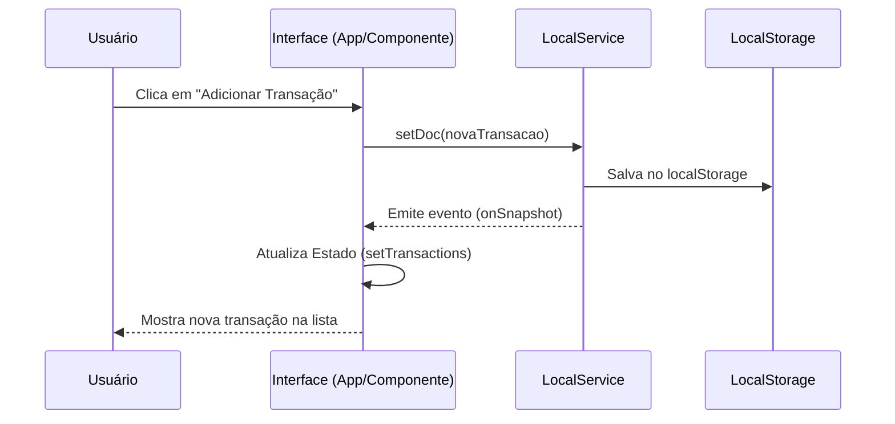

# Arquitetura e Fluxo do Aplicativo Flow Finance

Este documento detalha a arquitetura técnica, o fluxo de dados e a experiência do usuário do aplicativo **Flow Finance**. Ele foi projetado para ser compreensível tanto para desenvolvedores quanto para usuários finais.

---

## 🏗️ Visão Geral da Arquitetura

O Flow Finance segue uma arquitetura **Local-First** (no momento) com uma camada de abstração para serviços de dados. Isso significa que o aplicativo funciona inteiramente no navegador do usuário, salvando os dados localmente, mas está estruturado como se estivesse conectado a um backend real (Firebase), facilitando a migração futura.

### Camadas (Sprint 2)

- **Presentation**: `components/`, `pages/`, `App.tsx`
- **Application**: `src/app/`
- **Domain**: `src/domain/` (entidades e value objects puros)
- **Infrastructure**: `src/services/`, `src/storage/`, integrações externas
- **AI Engine**: `src/engines/ai/`

### Estrutura de referência criada

```text
src/
├ domain/
│ ├ entities/
│ │ ├ Transaction.ts
│ │ ├ Account.ts
│ │ ├ Goal.ts
│ │ └ User.ts
│ └ valueObjects/
│   ├ Money.ts
│   └ Category.ts
├ events/
│ ├ EventBus.ts
│ └ events/
│   ├ TransactionCreated.ts
│   ├ GoalCreated.ts
│   └ AITaskCompleted.ts
└ engines/
    ├ finance/
    │ ├ cashflowEngine.ts
    │ ├ forecastEngine.ts
    │ └ budgetEngine.ts
    └ ai/
        ├ aiOrchestrator.ts
        ├ aiContextBuilder.ts
        └ aiDecisionEngine.ts
```

### Diagrama de Componentes

```mermaid
graph TD
    User[Usuário] -->|Interage| App[App.tsx (Gerenciador de Estado)]
    App -->|Renderiza| Dashboard[Dashboard]
    App -->|Renderiza| Assistant[Assistente IA]
    App -->|Renderiza| Transactions[Lista de Transações]
    App -->|Renderiza| Settings[Configurações]
    
    subgraph Services [Camada de Serviços]
        LocalService[localService.ts (Mock Firebase)]
        GeminiService[geminiService.ts (IA)]
    end
    
    App -->|Lê/Escreve| LocalService
    Assistant -->|Consulta| GeminiService
    
    LocalService -->|Persiste| LocalStorage[(Browser LocalStorage)]
    GeminiService -->|API Call| GoogleAI[Google Gemini API]
```

---

## 🔄 Fluxo de Dados (Data Flow)

O fluxo de dados no aplicativo é unidirecional e reativo, garantindo que a interface esteja sempre sincronizada com o estado dos dados.

1.  **Ação do Usuário:** O usuário realiza uma ação (ex: adiciona uma despesa).
2.  **Atualização Local:** O componente chama uma função do `localService` (ex: `setDoc`).
3.  **Persistência:** O `localService` salva os dados no `localStorage`.
4.  **Notificação (Event Bus):** O `localService` emite um evento de atualização.
5.  **Sincronização:** O `App.tsx`, que está "ouvindo" (`onSnapshot`) essas mudanças, recebe os novos dados e atualiza o estado React.
6.  **Renderização:** A interface é atualizada automaticamente para refletir a nova transação.

### Diagrama de Sequência: Adicionar Transação



---

## 🧠 Integração com IA (Assistente)

O Assistente de IA permite que o usuário interaja com suas finanças usando linguagem natural.

1.  **Input:** O usuário digita "Gastei 50 reais no almoço".
2.  **Processamento:** O `Assistant.tsx` envia o texto para o `geminiService.ts`.
3.  **Interpretação:** A IA analisa a intenção e extrai:
    -   Valor: 50
    -   Categoria: Alimentação (inferido)
    -   Tipo: Despesa
    -   Data: Hoje
4.  **Confirmação:** O assistente sugere a transação estruturada.
5.  **Ação:** O usuário confirma e a transação é salva.

---

## 📱 Guia de Uso e Telas

### 1. Tela de Login / Cadastro
A porta de entrada do aplicativo.

-   **Login Rápido:** Use o botão de "Acesso Rápido" para testar sem criar conta.
-   **Cadastro:** Crie uma conta local com e-mail e senha.
-   **Recuperação:** Simulação de envio de e-mail de recuperação.

### 2. Dashboard Principal
O centro de controle financeiro.

-   **Resumo:** Cards com Receitas, Despesas, Investimentos e Saldo Atual.
-   **Gráficos:** Visualização da evolução do saldo e distribuição de gastos por categoria.
-   **Alertas:** Notificações sobre limites de gastos ou metas atingidas.

### 3. Assistente Inteligente
Seu consultor financeiro pessoal.

-   **Chat:** Converse sobre suas finanças.
-   **Comandos:** Peça para adicionar gastos, criar metas ou analisar seus hábitos.
-   **Insights:** Receba dicas personalizadas baseadas no seu histórico.

### 4. Transações e Extrato
O histórico detalhado.

-   **Lista:** Veja todas as movimentações em ordem cronológica.
-   **Filtros:** Busque por data, categoria ou tipo.
-   **Edição:** Corrija ou exclua lançamentos antigos.

---

## 🛠️ Como Testar e Desenvolver

### Rodando Localmente

1.  Clone o repositório.
2.  Instale as dependências: `npm install`
3.  Inicie o servidor: `npm run dev`
4.  Abra no navegador: `http://localhost:3000`

### Testando a Persistência

Como os dados são salvos no navegador:
-   Se você fechar a aba e abrir novamente, seus dados estarão lá.
-   Se você abrir em uma aba anônima, começará com um banco de dados vazio.
-   Para limpar tudo, use as ferramentas de desenvolvedor do navegador (Application > Local Storage > Clear).

---

## 🔮 Futuro do Projeto

O próximo passo na evolução do Flow Finance é a migração para um backend em nuvem real.

-   **Atual:** `localService.ts` (Simulação local)
-   **Futuro:** `firebase.ts` (Conexão real com Firestore e Auth)

A estrutura atual já está preparada para essa mudança, exigindo apenas a troca das importações nos arquivos principais.
