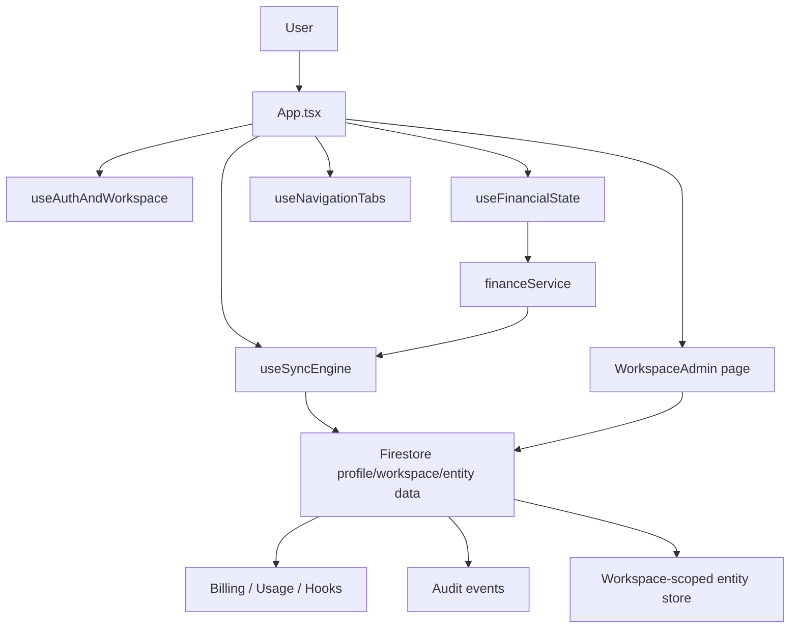

# Flow Finance Architecture

This document reflects the current application shape after the Firestore-first multi-tenant cutover.

## Overview

Flow Finance is now a React SPA with a thin composition root in [App.tsx](/E:/app%20e%20jogos%20criados/Flow-Finance/App.tsx), backed by:

- Firebase Auth for client identity bootstrap
- Firestore for profile state, tenant/workspace metadata, financial entities, SaaS usage, billing hooks, and audit logs
- Backend routes only for auxiliary flows that still need server-side mediation

The app is no longer local-first. `localStorage` is used only for lightweight client session helpers and safe workspace-scoped caches, not as the authoritative store for core business data.

## Frontend Layers

### Composition Root

[App.tsx](/E:/app%20e%20jogos%20criados/Flow-Finance/App.tsx) is responsible for:

- Sentry initialization
- composing the app hooks
- providing navigation context to pages/components
- rendering the application shell

Core domain logic no longer lives in `App.tsx`.

### Application Hooks

- [hooks/useAuthAndWorkspace.ts](/E:/app%20e%20jogos%20criados/Flow-Finance/hooks/useAuthAndWorkspace.ts)
  Handles auth bootstrap, backend session bootstrap, workspace selection, logout, and active workspace persistence.
- [hooks/useSyncEngine.ts](/E:/app%20e%20jogos%20criados/Flow-Finance/hooks/useSyncEngine.ts)
  Owns profile/entity sync state, Firestore sync, sync status, and temp-id reconciliation.
- [hooks/useFinancialState.ts](/E:/app%20e%20jogos%20criados/Flow-Finance/hooks/useFinancialState.ts)
  Exposes the single high-level domain API for transactions, accounts, goals, reminders, and alerts.
- [hooks/useNavigationTabs.tsx](/E:/app%20e%20jogos%20criados/Flow-Finance/hooks/useNavigationTabs.tsx)
  Owns active tab state and tab rendering.

### Domain Service Layer

[src/app/financeService.ts](/E:/app%20e%20jogos%20criados/Flow-Finance/src/app/financeService.ts) centralizes:

- entity normalization
- workspace/user ownership validation
- business rules such as “do not delete the last active account”
- goal contribution limits
- temp-id creation for optimistic UX
- sync invocation through the injected sync engine contract
- financial event emission

UI components should talk to `useFinancialState` or higher-level adapters, never directly to low-level sync helpers.

## Source of Truth

### Profile, Workspace, and SaaS Metadata

Firestore remains responsible for:

- `users/{userId}` for lightweight profile state such as name/theme/reminders/alerts
- `tenants/{tenantId}`
- `workspaces/{workspaceId}`
- `workspace_members/{workspaceId_userId}`
- `workspaces/{workspaceId}/billing_state/{docId}`
- `workspaces/{workspaceId}/saas_usage/{docId}`
- `workspaces/{workspaceId}/billing_hooks/{eventId}`
- `audit_logs/{tenantId}/events/{eventId}`

### Financial Entities

The authoritative path for:

- accounts
- transactions
- goals

is Firestore through [src/services/sync/cloudSyncClient.ts](/E:/app%20e%20jogos%20criados/Flow-Finance/src/services/sync/cloudSyncClient.ts) and the Firestore service layer in [src/services/firestoreWorkspaceStore.ts](/E:/app%20e%20jogos%20criados/Flow-Finance/src/services/firestoreWorkspaceStore.ts).

Every write is scoped with:

- `userId`
- `tenantId`
- `workspaceId`

Deletes are validated against the active ownership context before being persisted.

## Multi-Workspace Model

The active workspace is resolved on the client and propagated in authenticated requests through `x-workspace-id`.

Each financial entity carries:

- `user_id`
- `tenant_id`
- `workspace_id`

This allows:

- tenant-aware sync
- workspace-scoped SaaS entitlements
- auditability
- safer delete/update validation

## SaaS and Observability

SaaS usage, billing context, and event history are Firestore-backed:

- usage tracking: [src/saas/usageTracker.ts](/E:/app%20e%20jogos%20criados/Flow-Finance/src/saas/usageTracker.ts) configured through [src/saas/firestoreAdapters.ts](/E:/app%20e%20jogos%20criados/Flow-Finance/src/saas/firestoreAdapters.ts)
- billing state and hooks: [src/services/firestoreBillingStore.ts](/E:/app%20e%20jogos%20criados/Flow-Finance/src/services/firestoreBillingStore.ts)
- event engine: [src/events/eventEngine.ts](/E:/app%20e%20jogos%20criados/Flow-Finance/src/events/eventEngine.ts) with Firestore audit persistence for critical workspace events

The dedicated workspace administration UI lives in [pages/WorkspaceAdmin.tsx](/E:/app%20e%20jogos%20criados/Flow-Finance/pages/WorkspaceAdmin.tsx).
The dedicated audit page with filters lives in [pages/WorkspaceAudit.tsx](/E:/app%20e%20jogos%20criados/Flow-Finance/pages/WorkspaceAudit.tsx).

## Deployment and CI

- Vercel remains responsible for the frontend SPA deployment.
- Firestore security rule validation is not executed inside Vercel. It runs in GitHub Actions through [.github/workflows/firestore-rules.yml](/E:/app%20e%20jogos%20criados/Flow-Finance/.github/workflows/firestore-rules.yml), which provisions Java 21 for the Firebase emulator.
- Local rule validation uses `npm run test:firestore:rules`. The wrapper in [run-firestore-rules.mjs](/E:/app%20e%20jogos%20criados/Flow-Finance/scripts/run-firestore-rules.mjs) prefers an installed Temurin JDK 21 on Windows so the emulator does not depend on the global `PATH` being updated.
- The audit UI now supports date-range and resource-type filters with incremental pagination so large workspaces do not dump the full event list into the first render.
- Firestore rules now cross-check tenant ownership between `workspace_members`, `workspaces`, financial documents, billing documents, and audit events to reduce cross-tenant document injection risk.

OpenAPI docs are exposed in non-production environments through:

- `/api/openapi.json`
- `/api/docs`

## Current Runtime Flow

## Compatibility Notes

- [hooks/useCashFlowState.ts](/E:/app%20e%20jogos%20criados/Flow-Finance/hooks/useCashFlowState.ts) is now only a deprecated compatibility adapter to `useFinancialState`.
- Some legacy wrappers still exist for compatibility, but they should delegate to the canonical path instead of maintaining their own data logic.

## Near-Term Direction

The current architecture is optimized around:

- one source of truth per concern
- workspace-safe operations
- backend-owned financial persistence
- thin UI components

The next major improvements should continue along that line:

- finish migrating remaining compatibility wrappers out of active runtime paths
- add emulator-backed Firestore security tests in CI
- keep reducing the number of auxiliary backend flows that are not strictly required for Firebase-first operation
- expand integration and concurrency coverage around workspace isolation and health checks
