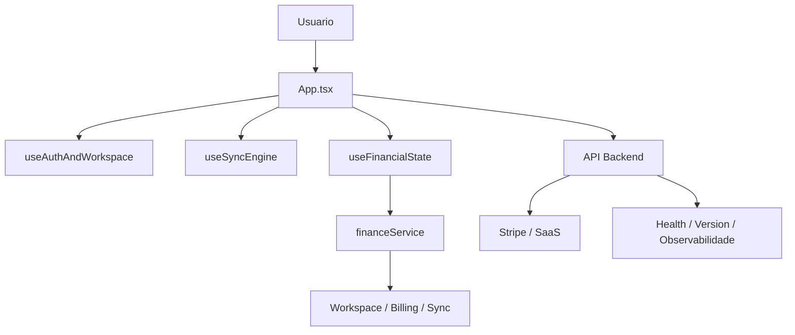

# Arquitetura do Flow Finance

## Papel deste documento

Este documento descreve a arquitetura ativa do produto e a distribuicao atual de responsabilidades entre frontend, backend, dominio e infraestrutura. Ele nao deve carregar backlog antigo nem status de release.

## Visao geral

O Flow Finance opera hoje como:

- frontend React com Vite
- backend Node.js com Express
- contexto orientado por workspace
- billing via Stripe
- observabilidade e health checks como contrato operacional minimo

O foco arquitetural atual e sustentar com clareza:

- fluxo de caixa e transacoes
- receitas previstas e realizadas
- apoio consultivo por IA
- billing e controle por plano
- operacao coerente entre web e mobile

## Camadas principais

### Frontend

Responsabilidades:

- composicao da interface e navegacao
- bootstrap de sessao e workspace
- consumo dos servicos de dominio
- renderizacao web e empacotamento mobile

Entradas principais:

- [App.tsx](E:\app e jogos criados\Flow-Finance\App.tsx)
- [hooks/useAuthAndWorkspace.ts](E:\app e jogos criados\Flow-Finance\hooks\useAuthAndWorkspace.ts)
- [hooks/useSyncEngine.ts](E:\app e jogos criados\Flow-Finance\hooks\useSyncEngine.ts)
- [hooks/useFinancialState.ts](E:\app e jogos criados\Flow-Finance\hooks\useFinancialState.ts)

### Backend

Responsabilidades:

- autenticacao e sessao nos fluxos suportados
- mediacao de chamadas sensiveis
- billing, checkout, portal e webhook
- health, version e observabilidade
- integracoes e servicos de suporte

Entrada principal:

- [backend/src/index.ts](E:\app e jogos criados\Flow-Finance\backend\src\index.ts)

### Servicos de dominio

O dominio nao deve ficar espalhado em componentes. Regras criticas devem viver em servicos, stores e hooks de alto nivel.

Arquivo central:

- [src/app/financeService.ts](E:\app e jogos criados\Flow-Finance\src\app\financeService.ts)

Responsabilidades:

- validacao de ownership
- normalizacao de entidades
- regras financeiras
- reconciliacao de ids
- sincronizacao e emissao de eventos internos

## Fontes de verdade por area

### Sessao e bootstrap

O sistema trabalha com dois contextos principais:

- fluxo real de autenticacao quando o ambiente esta configurado
- fallback controlado em `development` para nao bloquear o produto local

Arquivos principais:

- [components/Login.tsx](E:\app e jogos criados\Flow-Finance\components\Login.tsx)
- [hooks/useAuthAndWorkspace.ts](E:\app e jogos criados\Flow-Finance\hooks\useAuthAndWorkspace.ts)
- [src/services/backendSession.ts](E:\app e jogos criados\Flow-Finance\src\services\backendSession.ts)

### Workspace e persistencia

O workspace e a unidade operacional principal do sistema.

Regras ativas:

- operacoes sensiveis devem carregar `x-workspace-id`
- billing e uso sao associados ao workspace
- isolamento de dados depende de `user_id`, `tenant_id` e `workspace_id` quando aplicavel

Arquivos principais:

- [src/services/firestoreWorkspaceStore.ts](E:\app e jogos criados\Flow-Finance\src\services\firestoreWorkspaceStore.ts)
- [src/services/sync/cloudSyncClient.ts](E:\app e jogos criados\Flow-Finance\src\services\sync\cloudSyncClient.ts)

### Billing e SaaS

O backend concentra o fluxo sensivel de billing. O frontend apenas inicia checkout, consulta estado e abre portal.

Arquivos principais:

- [src/services/firestoreBillingStore.ts](E:\app e jogos criados\Flow-Finance\src\services\firestoreBillingStore.ts)
- [src/saas/usageTracker.ts](E:\app e jogos criados\Flow-Finance\src\saas\usageTracker.ts)
- [pages/WorkspaceAdmin.tsx](E:\app e jogos criados\Flow-Finance\pages\WorkspaceAdmin.tsx)
- [backend/src/services/saas](E:\app e jogos criados\Flow-Finance\backend\src\services\saas)

Estado arquitetural relevante:

- o nucleo Stripe sandbox foi validado localmente
- o fechamento do ambiente alvo depende de Vercel e nao de redesenho da arquitetura de billing

### Observabilidade

A arquitetura atual assume observabilidade minima e explicita.

Contratos ativos:

- `GET /health`
- `GET /api/health`
- `GET /api/version`

Campos esperados quando aplicavel:

- `requestId`
- `routeScope`
- dados de versao e observabilidade

Arquivos principais:

- [src/config/sentry.ts](E:\app e jogos criados\Flow-Finance\src\config\sentry.ts)
- [backend/src/config/sentry.ts](E:\app e jogos criados\Flow-Finance\backend\src\config\sentry.ts)
- [backend/src/index.ts](E:\app e jogos criados\Flow-Finance\backend\src\index.ts)

## Fluxo resumido de runtime

## Decisoes arquiteturais ativas

1. Manter o frontend fino em regra de negocio.
2. Centralizar logica financeira em servicos e hooks de alto nivel.
3. Tratar workspace como contexto obrigatorio para operacoes sensiveis.
4. Preservar health, version e observabilidade como contrato de runtime.
5. Evitar reintroduzir complexidade historica como se fosse fonte primaria de verdade.

## Limites deste documento

Este documento nao substitui:

- [docs/ARCHITECTURE_SYSTEM_MAP.md](E:\app e jogos criados\Flow-Finance\docs\ARCHITECTURE_SYSTEM_MAP.md) para leitura sistemica
- [docs/VERCEL_CONFIG.md](E:\app e jogos criados\Flow-Finance\docs\VERCEL_CONFIG.md) para ambiente
- [docs/DEPLOYMENT_STATUS.md](E:\app e jogos criados\Flow-Finance\docs\DEPLOYMENT_STATUS.md) para status operacional
